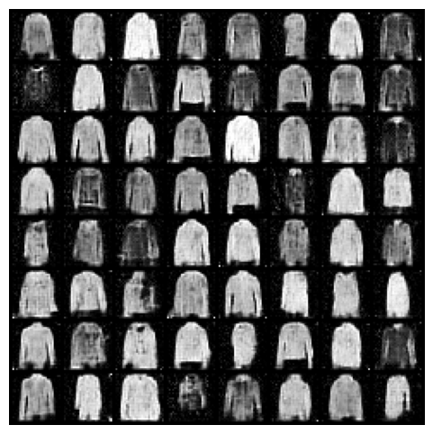
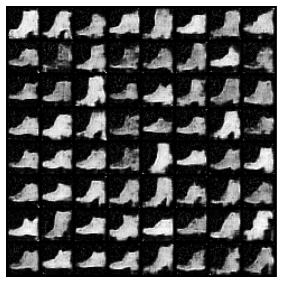
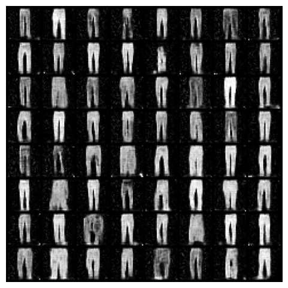
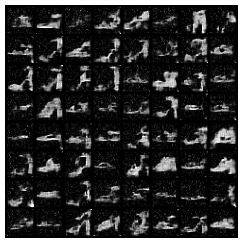

# Diffusion model

A self learning about diffusion model, based on [Tutorial on Stable Diffusion Models at ML from Scratch seminar series at Harvard](https://github.com/Animadversio/DiffusionFromScratch).

*Diffusion Model with Cross Attention (student).ipynb* is the **base code**. Using this, i have implement parts of:

- basic 1D forward/reverse diffusion
- a U-Net architecture for working with images
- the loss associated with learning the score function
- an attention model for conditional generation
- an autoencoder
  
The project uses MNIST, a set of 28x28 images of handwritten 0-9 digits. By the end, the model is able to take in a number prompt and output an image of the digit.

## Result MNIST

|  |  |  |  |
| :------------------------------: | :------------------------------: | :------------------------------: | :------------------------------: |
| U-Net (general)                            | U-Net Alternative (general)                | U-Net Transformer (digit 0)               | Autoencoder (digit 0)                      |

Then I also apply this to other datasets.

## Result FashionMNIST

|  |  |  |  |
| :------------------------------: | :------------------------------: | :------------------------------: | :------------------------------: |
| U-Net Transformer (Coat)                            | U-Net Transformer (Ankle Boot)                | U-Net Transformer (Trouser)               | U-Net Transformer (Sandal)                      |
